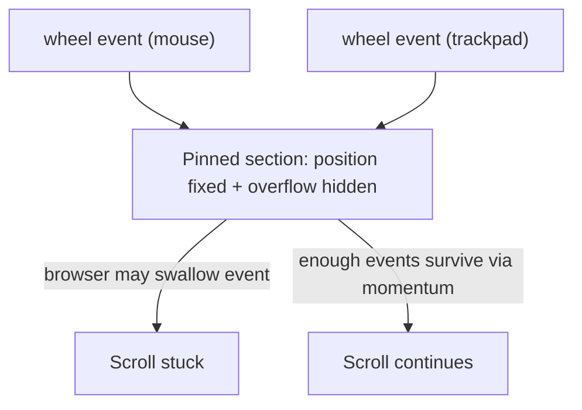

# Fix mouse wheel scroll blocking on pinned sections

## Problem

Some users cannot scroll past certain sections using a mouse scroll wheel, but can scroll normally with a trackpad. This is caused by the interaction between GSAP ScrollSmoother, ScrollTrigger pinning, and `overflow: hidden` on section elements.

## Root cause

When a section is pinned by ScrollTrigger it becomes `position: fixed`. Combined with `overflow: hidden` (from [src/styles/desktop.css](src/styles/desktop.css) line 34), the browser may treat it as a non-scrollable element and swallow discrete mouse wheel events. Trackpad events survive because they fire continuously with momentum. Without `normalizeScroll`, ScrollSmoother relies on native browser scroll propagation, which is inconsistent across browsers/OS/mouse hardware.




## Changes

### 1. Add `normalizeScroll: true` to ScrollSmoother

In [src/composables/useScrollAnimation.ts](src/composables/useScrollAnimation.ts), add `normalizeScroll: true` to the `ScrollSmoother.create()` call (around line 41). This makes GSAP intercept all wheel/touch events at the document level, bypassing browser quirks with `overflow: hidden` fixed elements.

```typescript
ScrollSmoother.create({
  wrapper,
  content,
  smooth: SCROLL_SMOOTHER_DESKTOP_SMOOTH,
  smoothTouch: SCROLL_SMOOTHER_TOUCH_SMOOTH,
  normalizeScroll: true,
  effects: false,
})
```

### 2. Change `overflow: hidden` to `overflow: clip` on sections

In [src/styles/desktop.css](src/styles/desktop.css) line 34, replace `overflow: hidden` with `overflow: clip`. This prevents visual overflow identically but does **not** create a scroll context, so it cannot trap wheel events. Well-supported in all modern browsers.

```css
section {
  /* ... */
  overflow: clip;
}
```

### 3. (Optional) Same change on `#smooth-wrapper`

In [src/App.vue](src/App.vue) line 39, change `overflow: hidden` to `overflow: clip` on `#smooth-wrapper`. ScrollSmoother sets its own overflow internally; having it also in CSS doubles the scroll-trap surface. If ScrollSmoother requires `overflow: hidden` at runtime it will set it itself.

## Testing

- Test on desktop with a standard mouse (discrete scroll wheel) -- should scroll through all pinned sections without getting stuck.
- Test on desktop with a trackpad -- should still work as before.
- Test on mobile / narrow viewport (below 48rem) -- ScrollSmoother is desktop-only so no change expected.
- Cross-browser: Chrome, Firefox, Safari.

