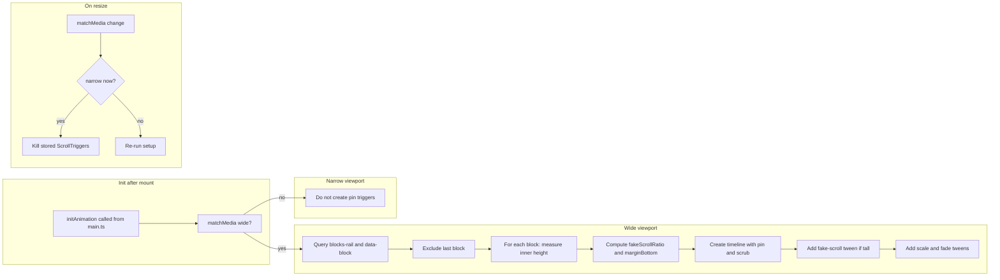

# Plan: GSAP slide pinning and overscroll (CodePen bGRdvMy behavior)

## Target behavior (from the CodePen)

- **Scroll**: Normal document scroll (body scrolls).
- **Per section (all but the last)**: When the section’s bottom hits the viewport bottom, the section **pins** and a **scrubbed** timeline runs:
  1. If the section’s inner content is **taller than the viewport**: a “fake scroll” phase moves the inner content up (so the user effectively scrolls inside the section).
  2. Then the section **scales down** (1 → 0.7) and **fades** (1 → 0.5 → 0).
- **Last section**: No pin; it just scrolls into view.
- **Overscroll**: For tall sections, extra bottom margin is added so the total scroll distance matches the combined “fake scroll” + “scale/fade” distance.

## Scope and constraints

- **Desktop only (wide viewport, 48rem)**: Pinning/scrub runs only when `min-width: 48rem`. Below that, keep current normal scroll (no JS pinning).
- **Single place for logic**: All ScrollTrigger/slide-pinning logic lives in [src/composables/useAnimation.ts](src/composables/useAnimation.ts); no new composables. Section components stay as they are (no per-component animation code).
- **DOM mapping**: CodePen’s `.section` → our `[data-block]`; CodePen’s `.section-inner` → our `[data-block-inner]`. The rail is `.blocks-rail` inside `.block-viewport` ([src/views/DesktopView.vue](src/views/DesktopView.vue)).

## Implementation steps

### 1. Desktop CSS for pinning

**File:** [src/styles/desktop.css](src/styles/desktop.css)

- Ensure **scroll container** is the document: body has `overflow-y: scroll` (and `overflow-x: hidden` if not already). The pen uses this so ScrollTrigger’s scroll is the same as the user’s scroll.
- For **wide viewport only**, adjust blocks so they work with pinning:
  - `**[data-block]`**: Give a **fixed height** for the pin (e.g. `height: 100dvh`) so each block is one viewport tall. This is required so the pin and scrub duration behave like the pen.
  - `**[data-block-inner]`**: Set `height: 100%`, `overflow: hidden`, and keep `overflow-x: hidden`. This allows inner content to be taller than the viewport; the JS will “fake scroll” it with a transform. Optionally keep `min-height: 100dvh` for short sections so they still fill the viewport.
- Leave `.block-viewport` and `.blocks-rail` as they are (height auto, visible overflow) so the page can scroll normally.

Result: On desktop, each block is a full-height box with a possibly taller inner; on mobile, existing rules stay so layout is unchanged.

### 2. Slide-pinning logic in useAnimation

**File:** [src/composables/useAnimation.ts](src/composables/useAnimation.ts)

- **Keep** existing: `gsap.registerPlugin(ScrollTrigger)`, the dev-only `ScrollTrigger.create` marker patch, and `initAnimation()`.
- **Extend** `initAnimation()` (or add a separate function called from it) so that after the DOM is ready it:
  1. Uses `**window.matchMedia('(min-width: 48rem)')`** to run pinning setup only when the viewport is wide.
  2. Queries `**.blocks-rail`** and gets all `**[data-block]`** elements; **removes the last one** from the list (like the pen’s `panels.pop()`).
  3. For **each** remaining block:
    - **Inner**: `panel.querySelector('[data-block-inner]')` (our equivalent of `.section-inner`).
    - **Heights**: `panelHeight = inner.offsetHeight`, `windowHeight = window.innerHeight`, `difference = panelHeight - windowHeight`.
    - **Fake-scroll ratio**: `fakeScrollRatio = difference > 0 ? difference / (difference + windowHeight) : 0`.
    - If `fakeScrollRatio > 0`: set `panel.style.marginBottom = panelHeight * fakeScrollRatio + 'px'` so scroll distance matches the combined animation.
    - **Timeline** with ScrollTrigger:
      - `trigger: panel`
      - `start: "bottom bottom"`
      - `end: fakeScrollRatio ? \`+={inner.offsetHeight} : "bottom top"`
      - `pinSpacing: false`, `pin: true`, `scrub: true`
    - If `fakeScrollRatio > 0`: add to timeline `tl.to(inner, { yPercent: -100, y: windowHeight, duration: 1 / (1 - fakeScrollRatio) - 1, ease: "none" })`.
    - Then: `tl.fromTo(panel, { scale: 1, opacity: 1 }, { scale: 0.7, opacity: 0.5, duration: 0.9 }).to(panel, { opacity: 0, duration: 0.1 })`.
  4. **Store** the created ScrollTrigger instances (e.g. from each timeline’s `scrollTrigger` property) so they can be killed on cleanup.
- **Cleanup / resize**: Add a listener to the same `matchMedia` query. When it changes to **not** matching (viewport becomes narrow), **kill** all stored ScrollTrigger instances so mobile has normal scroll without pinning. When it changes to matching again (e.g. resize to desktop), run the setup again (after a short delay or `ScrollTrigger.refresh()` if needed). This keeps behavior correct on resize and avoids duplicate triggers.
- **Timing**: Run this setup inside `requestAnimationFrame` (or after a short delay) after `initAnimation()` is called from [src/main.ts](src/main.ts), so the Vue app has mounted and `.blocks-rail` / `[data-block]` exist. No change to where `initAnimation()` is called (still from main.ts after `app.mount('#app')`).

### 3. Dev demo trigger

- **Option A**: Remove the current dev-only “demo” ScrollTrigger that creates a single full-page trigger (so it doesn’t conflict with the real pin triggers).
- **Option B**: Keep it but only run it when slide pinning is **not** active (e.g. when viewport is narrow), so dev markers still appear on mobile. Prefer **Option A** for simplicity: one set of triggers (the real pin triggers) is enough; they already get markers in dev from the existing patch.

### 4. No changes to section components or DesktopView

- Section Vue components stay as they are: no new refs, no animation imports, no `useAnimation` usage inside sections. Structure is already correct: each section root has `data-block` and contains a single `data-block-inner`.
- [DesktopView.vue](src/views/DesktopView.vue) is unchanged; it only renders the list of sections inside `.blocks-rail`.

## Flow summary

## Files to touch

| File                                                               | Change                                                                                                                                                                           |
| ------------------------------------------------------------------ | -------------------------------------------------------------------------------------------------------------------------------------------------------------------------------- |
| [src/styles/desktop.css](src/styles/desktop.css)                   | Body scroll; fixed height and overflow for `[data-block]` / `[data-block-inner]` on desktop.                                                                                     |
| [src/composables/useAnimation.ts](src/composables/useAnimation.ts) | Add slide-pinning setup (matchMedia, loop over blocks, timelines with pin/scrub and optional fake scroll); store and kill triggers on resize; remove or narrow dev demo trigger. |
| [src/main.ts](src/main.ts)                                         | No change (already calls `initAnimation()`).                                                                                                                                     |

## Testing

- **Desktop**: Scroll the page; each section (except the last) should pin when its bottom hits the viewport bottom, scrub through scale/fade (and inner “scroll” when content is tall), then release. Last section scrolls in normally.
- **Mobile**: No pinning; normal scroll. Resizing from desktop to mobile should remove pinning; resizing back should restore it.
- **Dev**: ScrollTrigger markers (if kept) should show on the pin triggers when markers are enabled.

## Optional follow-ups (out of scope for this plan)

- Expose a way to **opt out** a specific section from pinning (e.g. `data-pin="false"`) if one section should behave like the “last” section.
- Tune **scale/opacity** values or **ease** to match design (pen uses 0.7, 0.5, 0.1 durations).

